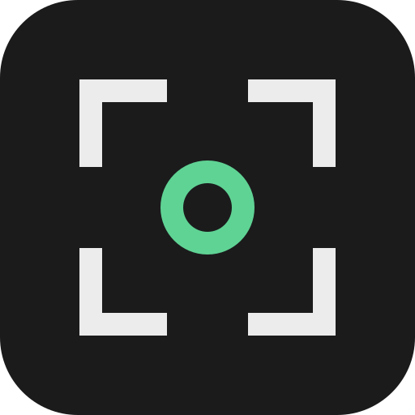
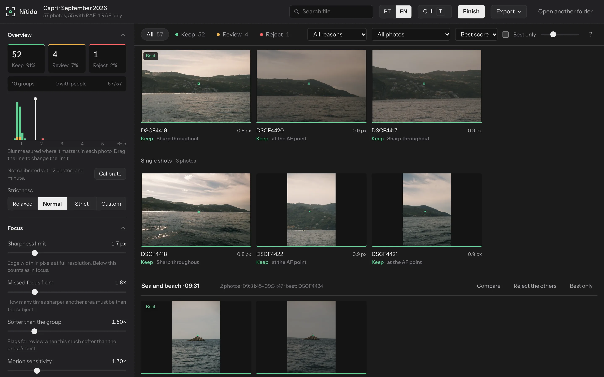
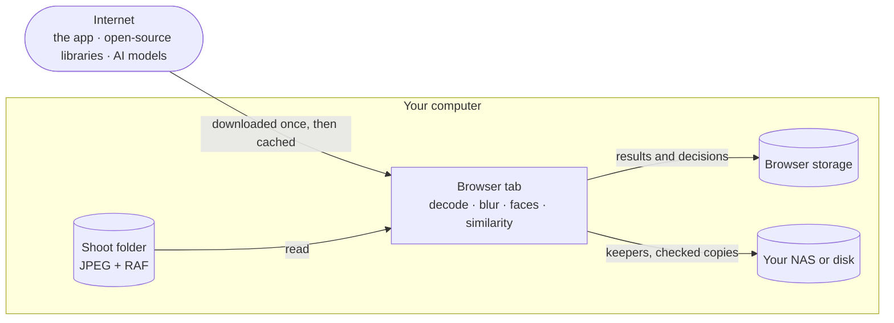
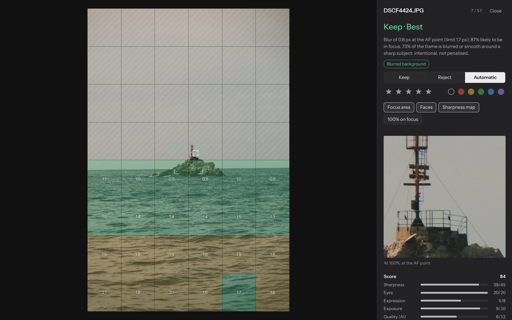
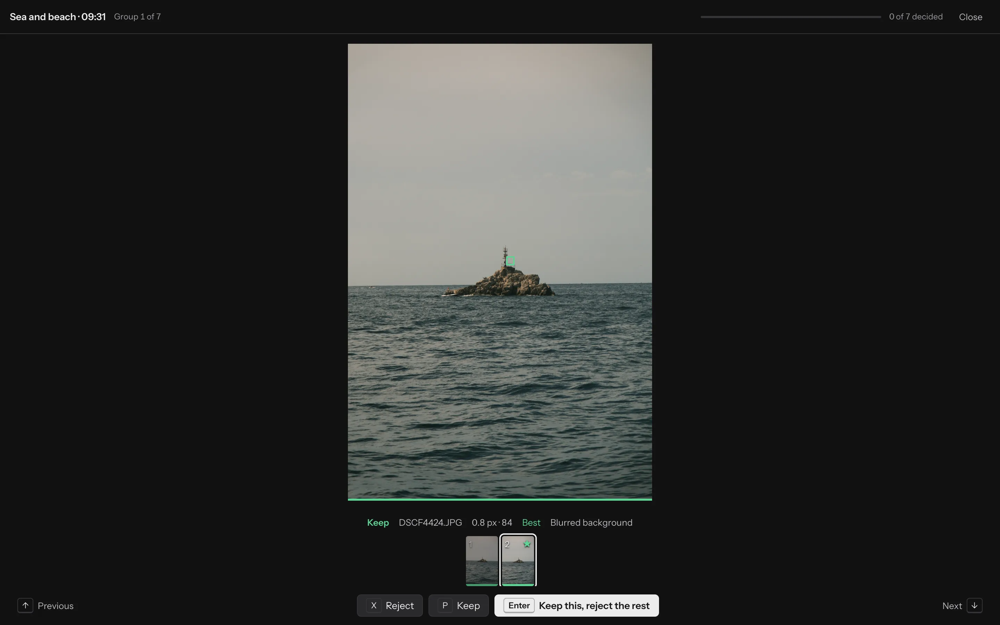
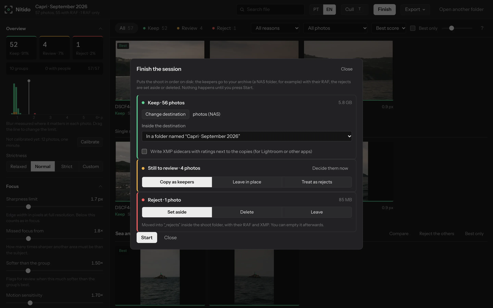
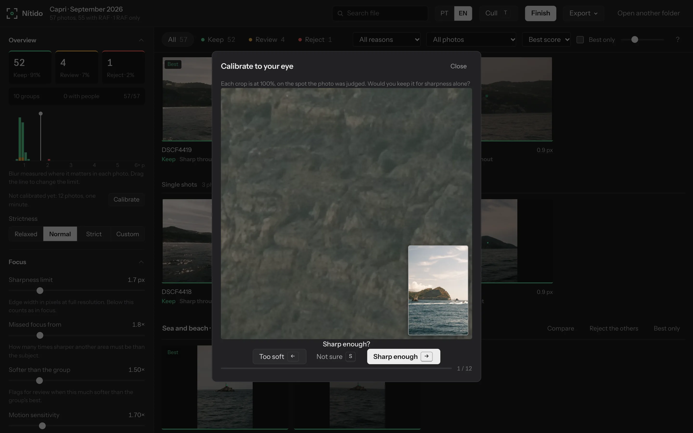
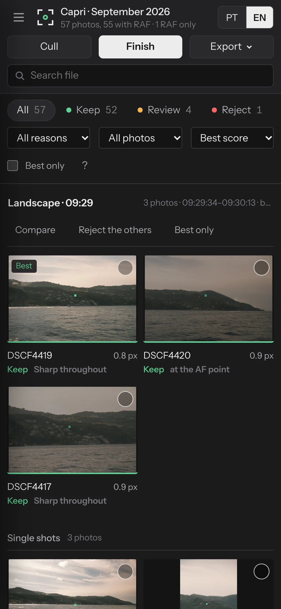
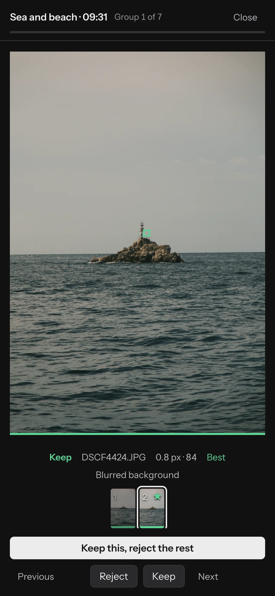

<div align="center">



# Nítido

### Cull a whole Fujifilm shoot in your browser.<br>Your photos never leave your computer.

Focus measured at 100% on the eyes, the AF point or the subject. Bursts grouped, the best frame picked,<br>
the keepers copied to your NAS. All of it computed on your machine: no server, no upload, no account.

[](https://brunoaclopes.github.io/nitido/)


[](https://github.com/brunoaclopes/nitido/releases)
[](https://github.com/brunoaclopes/nitido/actions/workflows/ci.yml)
[](LICENSE)


**English** · [Português](#português)

[Privacy](#private-by-design) · [What it does](#what-it-does) · [Use it](#use-it) · [Install](#install-it-as-an-app) · [Phone or tablet](#on-a-phone-or-tablet) · [Browsers](#which-browser) · [Your own server](#run-it-on-your-server) · [A shoot](#a-shoot-start-to-finish) · [Developers](#for-developers)



</div>

## Private by design

Nítido has no backend. The site is a handful of static files; once your browser has them, everything happens on your computer:

- **Your photos are read, not sent.** The browser opens the folder you choose and the app reads the files from disk. There is no upload code and no server to upload to.
- **The AI runs locally.** Face, eye and subject detection (MediaPipe) and the similarity model (MobileCLIP or SigLIP) run inside the browser, in web workers and WebAssembly. The models are downloaded *to* you, like any file; your photos are never sent *to* them.
- **Your work stays in your browser.** Measurements, small thumbnails, your decisions and your personal taste model live in the browser's own storage on your computer. Nítido asks the browser not to clear that storage when the disk fills up. Clearing the site's data yourself removes all of it, and *Save to a file* keeps your settings and personal model as a backup.
- **Your files go straight to your disk.** *Finish* copies the keepers to your NAS or archive drive over your own network, with no cloud in between.
- **No accounts, no analytics, no cookies, no tracking.**
- **Works offline.** Install it from the address bar. After the first analysis, you can turn Wi-Fi off and cull a whole shoot.



<sub>The only arrow that crosses the edge of your computer points inwards.</sub>

### Don't take our word for it

- **Watch the network.** Open DevTools → *Network* and analyse a folder. You will only see downloads (`GET`) of the app, the libraries and the models. No request carries a photo or anything else from your computer.
- **Pull the plug.** Once the models are cached, analyse a shoot with the network off. It works the same.
- **The browser enforces it.** The page carries a Content-Security-Policy that lets it connect only to its own site, the library CDN and the model hosts. Even a bug or a compromised library could not send a photo anywhere else: the browser would block the request.
- **The tests check it.** The browser test records every request a full session makes, from the page and its workers: analysing, culling, reanalysing, sorting files, exporting. The run fails if any request is not a plain download from those sources. A 12-photo run against the published site made 400 requests, and every one was a download, from the app's own host and three known sources. The full list is in [`tests/browser.e2e.mjs`](tests/browser.e2e.mjs).

The servers that host the app, the libraries and the models (GitHub Pages, jsDelivr, Google's model storage and Hugging Face) see a request from your IP address, as with any website. They never see a photo. The font comes with the app, so no font service sees your visit. To skip the other hosts entirely, [run Nítido on your own server](#run-it-on-your-server), where everything comes from that server.

## What it does

| | |
| --- | --- |
|  | **Judges every photo at 100%.** Blur is measured as edge width in pixels on the eyes, the AF point or the subject, then over the whole frame as a sharpness map. Closed eyes, motion blur, missed focus and blown highlights each get a plain-language reason. |
|  | **Culling mode, one group at a time.** The suggested best is shown large and the rest of the burst sits in a strip. With people in the frame, each face is lined up across the burst, so the frame where everyone's eyes are open stands out. <kbd>Enter</kbd> keeps it and rejects the rest. |
|  | **Finish, without Lightroom.** Keepers are copied with their RAF to your NAS or archive, and each copy is checked. Rejects are set aside in a `_rejects` folder or deleted. You see how many photos go where before anything happens. |
|  | **Calibrated to your eye.** You answer "sharp enough?" for twelve crops at 100%, and the sharpness limit fits your answers. A personal model also learns from every keep or reject you make by hand, across shoots. It is trained in your browser and stays there. |

<div align="center">
&nbsp;&nbsp;
<br><sub>Works on phones and tablets too, and <a href="#install-it-as-an-app">installs as an app</a> that runs offline.</sub>
</div>

**Also:**
- **Fujifilm film recipes:** the loupe shows the recipe from the camera, with a filter for each film simulation.
- **Compare with synced zoom:** zoom stays in step across the photos you compare.
- **XMP sidecars:** stars, colour labels and keywords for Lightroom, if you use it.
- **Survives a refresh:** reload in the middle of a shoot and nothing is lost.
- **Your profile in a file:** settings and personal model, to back up or move to another browser.
- **Three themes:** Dark, Light and a Liquid glass theme that really bends light.
- **Two languages:** English and Portuguese.

## Use it

**Online:** open **[brunoaclopes.github.io/nitido](https://brunoaclopes.github.io/nitido/)** and choose your shoot folder: JPEG and RAF together, straight off the card. It works in any current browser on a computer, phone or tablet. Chrome or Edge on a computer can also sort the files into place ([what each browser can do](#which-browser)). The AI models download once, 100 to 400 MB depending on the tier, and are cached.

**Locally:** with [Node.js](https://nodejs.org) 18 or newer, there is nothing to install:

```sh
npm start            # opens http://127.0.0.1:4173
npm run models       # optional: keep the AI models and libraries in ./models, so nothing comes from their hosts
```

**Nothing is lost.**
- Results and your decisions are saved in the browser as you go, so reopening a folder is instant.
- After a refresh in the middle of a shoot, Chrome and Edge reopen the folder by themselves, on the same filters and photo. Other browsers ask for the folder again, and nothing is measured twice.
- **Reanalyse** measures the folder again from scratch, after you change the AI models or add files, and keeps your decisions.

**Your profile.** Under *AI models › Your profile*:
- **Save to a file** keeps your settings and personal model in one small JSON file, with no photo in it. Keep it as a backup, or load it in another browser.
- **Load from a file** brings a profile back. It merges its decisions into your personal model and asks before replacing your settings.
- **Decisions from another device:** *Load from a file* also takes the *Export › JSON report* of a shoot culled on another device. With the same folder open, it applies those decisions here. That is how a shoot culled on a tablet gets finished on a computer.
- On a [self-hosted copy](#run-it-on-your-server), the profile and every shoot's decisions are kept on the server, with nothing to save by hand.

**Theme.** The half-circle button in the top bar switches between three themes:
- **Dark:** neutral greys. It is the default and the best for judging colour.
- **Light:** bright neutral greys, for daylight.
- **Liquid glass:** floating glass panels over a slowly moving wallpaper, in the style of macOS. In Chrome and Edge the glass bends light at its rim like a lens, after [kube.io's write-up](https://kube.io/blog/liquid-glass-css-svg/). It turns solid when the system asks for reduced transparency.

**AI tier.** Under *AI models*, pick how much work the analysis does. The app suggests a tier for your computer from its cores, its memory and the speed of earlier runs.

| Tier | Similarity and quality | Subject detector | Download | Per photo* |
| --- | --- | --- | --- | --- |
| Light | MobileCLIP S0 | EfficientDet-Lite0 | ~100 MB | 0.3 s |
| Standard | MobileCLIP S2 | EfficientDet-Lite0 | ~220 MB | 0.9 s |
| Heavy | SigLIP B/16 | EfficientDet-Lite2 | ~225 MB | 1.5 s |
| Max | SigLIP 2 B/16 | EfficientDet-Lite2, full precision | ~405 MB | 1.5 s |

<sub>*Measured on a 12-core Mac. The similarity model runs in the background while the photos are measured.<br>
SigLIP and SigLIP 2 are the Pareto-optimal models in [Immich's search benchmark](https://docs.immich.app/features/searching): 81.9% and 84.9% recall, against 69.9% for OpenAI's ViT-B/32. MobileCLIP is Apple's lighter family, also ahead of ViT-B/32. Each model's similarity scale was calibrated on X-H2 bursts. `npm run models -- heavy` keeps a tier's models for offline use.</sub>

### Install it as an app

Nítido is a web app that installs like an app: it gets its own icon and window, and it opens without the browser's toolbars. After the first analysis has cached the AI models, it works with no internet, and updates arrive by themselves the next time it is opened online.

| Device | How |
| --- | --- |
| Computer, Chrome or Edge | The install icon at the right of the address bar, or the menu › *Install Nítido* (Chrome: *Cast, save and share › Install page as app*) |
| Mac, Safari | *File › Add to Dock* |
| iPhone, iPad | In Safari: *Share › Add to Home Screen* |
| Android | In Chrome: the menu › *Install app* (or *Add to Home screen*) |

The installed app keeps the browser's storage, so your decisions and personal model are there. One exception: on iPhone and iPad, a home-screen app has its own storage, separate from Safari's. Move a profile between them with *Save to a file*.

### On a phone or tablet

You can analyse and cull a whole shoot on an iPad or a phone. The files are put in order from a computer, because a mobile browser cannot copy photos into other folders.

1. **Get the shoot into a folder.**
   - iPhone or iPad: plug in a card reader (or the camera) and copy the card to a folder in the *Files* app.
   - Android: copy it to a folder with the *Files* app.
   - Folder selection needs iOS or iPadOS 18.4, or Chrome on Android. A photo library is not a folder; photos sent to the phone by the camera's app have to be saved to a folder first.
2. **Open Nítido and choose that folder.** On a phone, the app suggests the Light AI tier, which is gentler on battery and memory. Big shoots are faster on a computer.
3. **Cull with your fingers.**
   - Tap a photo to open it, then tap the photo for 100% where you tapped.
   - Swipe left and right between frames.
   - Tap the circle on a photo to select it, and use the bar that appears for keep, reject, compare or group.
   - **Cull** goes one group at a time; *Keep this, reject the rest* finishes a burst in one tap.
   - The **?** button lists every gesture. With a keyboard attached, every shortcut works too.
4. **Finish on a computer.**
   - *Finish* explains the steps.
   - Save your decisions to a file. Then, on the computer, open the same folder in Chrome or Edge and load that file under *Your profile*.
   - With a [self-hosted copy](#run-it-on-your-server), there is nothing to carry: the decisions are already on the server.

On a tablet, the loupe puts its panel beside the photo in landscape and below it in portrait. The tuning panel opens from the ☰ button.

### Which browser

| | Chrome, Edge (computer) | Safari, Firefox (computer) | iPhone, iPad, Android |
| --- | --- | --- | --- |
| Analyse, cull, compare, calibrate | ✓ | ✓ | ✓ |
| Drop a folder on the window | ✓ | ✓ | — |
| Reopen the folder by itself after a refresh | ✓ | asks for the folder again | asks for the folder again |
| Finish: copy the keepers to your NAS, set rejects aside | ✓ | a `.sh` or `.ps1` script that does it | on a computer, [as above](#on-a-phone-or-tablet) |
| XMP sidecars | next to the photos | a ZIP to unpack in the folder | a ZIP |
| Install as an app, offline | ✓ | Safari: *Add to Dock* | ✓ |

Every one of them keeps the photos on your device.

## Run it on your server

On a home server or a NAS, one container holds the app, every AI model and the libraries. The page then makes no request outside your server, and your profile lives there too.

```sh
docker run -d --name nitido -p 8080:8080 -v ./data:/data ghcr.io/brunoaclopes/nitido
```

Or use `docker compose up -d` with the [docker-compose.yml](docker-compose.yml) in this repository.

**Versions.**
- `latest` is the newest [release](https://github.com/brunoaclopes/nitido/releases). A version tag such as `1.2.0` (or `1.2`) stays put until you change it, and `main` follows every change.
- To update, run `docker compose pull && docker compose up -d`. Profiles in `/data` are kept.
- The version you run is shown in the app's **?** help, and in the server's first log line. The image is built for amd64 and arm64 (Synology, Raspberry Pi and the like). Then serve it over [HTTPS](#https-on-your-network).

What you get over the public site:
- **Your profile follows you.** Your settings, your personal model and each shoot's decisions are kept on the server, as JSON files in `/data`.
  - Open Nítido in another browser or on another computer and you start with the same settings and model.
  - Open the same folder there and your decisions are waiting.
  - Each person can keep their own profile: type a name in *Profile on this server*. There are no accounts.
  - Photos and thumbnails never go to the server; only those small JSON documents do.
- **Nothing leaves your network.** With every model inside the image, the server's Content-Security-Policy lets the page talk to that server only. The browser test checks this too. A 12-photo session on a self-hosted copy made 535 requests, all to its own server. The only thing sent was 11 KB of profile saves (JSON, no image).
- **Defaults for your household or studio**, for browsers opening Nítido for the first time. Everyone can still change their own.

| Variable | Values | Sets |
| --- | --- | --- |
| `NITIDO_LANG` | `en`, `pt` | Language |
| `NITIDO_THEME` | `dark`, `light`, `glass` | Theme |
| `NITIDO_TIER` | `light`, `standard`, `heavy`, `max` | AI tier (otherwise suggested for each computer) |
| `NITIDO_STRICTNESS` | `relaxed`, `normal`, `strict` | How sharp a keeper must be |
| `NITIDO_LAYOUT` | `folder`, `date`, `flat` | Finish: where the keepers go |
| `NITIDO_REVIEW` | `keep`, `leave`, `reject` | Finish: photos still to review |
| `NITIDO_REJECTS` | `move`, `delete`, `leave` | Finish: rejects |
| `NITIDO_XMP` | `true`, `false` | Finish: copy XMP sidecars too |
| `NITIDO_DEFAULTS` | JSON | Any other setting, e.g. `{"groupSim":0.7}` |
| `NITIDO_LOCAL_ONLY` | `1` | Allow only the AI tiers stored in the image |
| `PUID`, `PGID` | user and group ids | Owner of `/data` on your NAS (default 1000) |

**Keep it on your network.** The server has no login: anyone who can reach it can open the profiles on it, though never a photo, since none are there. That is fine at home or behind Tailscale. To expose it to the internet, put it behind a proxy that asks for a password.

**A smaller image.** The full image is about 1 GB. To build one with fewer tiers, run `docker build --build-arg TIERS=standard -t nitido .`; with only the Light tier it is about 300 MB. A tier that isn't inside is downloaded from its hosts when someone picks it, unless `NITIDO_LOCAL_ONLY=1` turns it off.

**Without Docker:**

```sh
npm run models -- all
HOST=0.0.0.0 node server.mjs --data ./data
```

### HTTPS on your network

Chrome and Edge give folder access, writing and offline use only to HTTPS pages (or `localhost`). Opened as `http://nas:8080` from another computer, Nítido still analyses photos you choose, but it cannot:
- open a folder directly;
- write the keepers to your NAS;
- work offline.

It says so on its start screen. Any of these fixes it:
- **Tailscale:** run `tailscale serve --bg 8080` on the server and open `https://<machine>.<tailnet>.ts.net`, with a real certificate.
- **A reverse proxy you already run:** Synology's, Nginx Proxy Manager, Traefik or Caddy, with a certificate for your domain.
- **The compose file's Caddy service:** run `docker compose --profile https up -d` and open `https://nitido.local` (or set `NITIDO_HOST`). Caddy signs the certificate with its own authority, so install its root certificate on your computers once: `docker compose cp caddy:/data/caddy/pki/authorities/local/root.crt .`

## A shoot, start to finish

1. **Open the folder** with *Choose folder*, or drop it on the window. Each photo gets **Keep**, **Review** or **Reject**, with the reason.
2. **Cull** with <kbd>T</kbd>: go through the groups and the photos still to review.
   - <kbd>Enter</kbd> keeps the frame shown and rejects the rest.
   - <kbd>P</kbd> or <kbd>X</kbd> decides one photo, and <kbd>↑</kbd> <kbd>↓</kbd> change group.
   - <kbd>Z</kbd> zooms to 100%.
3. **Finish:** pick the NAS folder once (it is remembered) and press Start.
   - Keepers are copied with their RAF and XMP, and so are the photos still to review if you choose. They go into a folder named after the shoot, into date folders (`2026/2026-09-15`), or straight in. Every copy is checked by size. Files already there are skipped, so an interrupted run can simply be repeated. Originals stay where they are.
   - Rejects are set aside in `_rejects` inside the shoot folder (the default), or left alone. You can also delete them for good, after a confirmation, since a browser cannot use the bin. Once you have looked, *Empty* removes the `_rejects` folder.
   - Safari and Firefox cannot write to your folders. There, Finish downloads a `.sh` or `.ps1` script that does the same.

Lightroom is optional: XMP sidecars with stars, colour labels and keywords can be written next to the photos or the copies.

<details>
<summary><b>Every feature, where to find it</b></summary>

**Top bar**
- **Search file:** jump to a photo by name.
- **PT / EN:** the language.
- **Theme:** the half-circle button.
- **Cull** (<kbd>T</kbd>): culling mode.
- **Finish:** sort the files on disk.
- **Export:**
  - *XMP sidecars*: written next to the photos, merged with any XMP already there. Where the browser cannot write, you get a ZIP to unpack in the folder.
  - *CSV table*: every metric, one row per photo.
  - *JSON report*: groups, decisions and detailed scores. It is also the file that carries decisions to another device.
  - *Scripts to move rejects*: `.sh` and `.ps1`.
- **Reanalyse**, **Open another folder:** on narrow screens these two move into the ☰ panel.

**Gallery**
- **Tabs** (*All*, *Keep*, *Review*, *Reject*) filter by verdict.
- **Reasons** narrow it to one reason: closed eyes, motion blur, missed focus and so on.
- **Photo filters:** faces, subjects, each Fujifilm film simulation, and more.
- **Sort** by best score, time, sharpness or name.
- **Best only** shows one photo per group, and the slider sets the photo size.
- Photos sit in **scenes** (gaps in time) and **groups** (similar shots).
  - Click a group's name to rename it.
  - *Compare* opens the group side by side.
  - *Reject the others* keeps the suggested best.
  - *Best only* or *Show all* folds a long burst.
- **Selection:**
  - The circle on a photo, <kbd>Shift</kbd>-click for a range, or <kbd>Ctrl</kbd>/<kbd>⌘</kbd>+<kbd>A</kbd> for all.
  - The bar that appears keeps, rejects, compares, or *Groups together* the selected photos.
  - Bulk decisions can be undone from the message that follows.

**Loupe** (a photo opened)
- **Decision:** *Keep*, *Reject* or *Automatic*, with the verdict and its reason in plain words.
- **Stars and labels:** 1–5 stars and a colour label, written into XMP.
- **Overlays:**
  - *Focus area*: where the blur was measured.
  - *Faces*: with their eye state.
  - *Sharpness map*: the whole frame.
  - *100% on focus*: zooms to the measured spot. Click or tap the photo to zoom where you point.
- **Film recipe:** below the photo's details, with how many photos share it, and a button that copies it as text.

**Compare** (<kbd>C</kbd>): up to four photos side by side. Click or tap one to zoom all of them to 100% at the same spot. *Pick this*, or <kbd>1</kbd>–<kbd>4</kbd>, keeps that one and rejects the others.

**Tuning panel** (the left column; ☰ on narrower screens)
- **Overview:**
  - The blur histogram of the shoot. Drag its line to move the sharpness limit and watch the verdicts change live.
  - *Calibrate* fits the limit to your eye.
  - *Strictness*: *Relaxed*, *Normal*, *Strict* or *Custom*.
- **Focus:** the sharpness limit in pixels, when focus counts as missed, how much softer than the group is too soft, motion sensitivity, and when a blurred background counts as intentional.
- **People:** when an eye counts as closed, which faces to check, whether closed eyes reject, and over- and underexposure.
- **Groups:** how similar shots must be, and the gaps that start a new scene or burst.
- **AI models:**
  - The tier, and which models to use.
  - *Reanalyse*.
  - The *personal model*, which you can switch on, off, or make forget what it learned.
  - *Your profile*: save to a file, load from a file, and the profile on a self-hosted server.
- **Export:** how rejects are written to XMP, and whether keywords are included.
- **Comparison:** *Set baseline*, change any setting, and see how many photos changed verdict. *Reset values* puts every setting back.

</details>

<a name="how-a-photo-is-judged"></a>
<details>
<summary><b>How a photo is judged</b></summary>

1. **Decode** the JPEG (or the RAF's embedded preview) in a worker, in horizontal strips, never holding a full-size canvas.
2. **Find faces and subjects** with MediaPipe: blink probability per eye, smile, head turn, and objects such as cars, animals and people.
3. **Choose where to measure.** In order of preference:
   1. the main face's eyes;
   2. the face;
   3. the camera's own eye and face boxes;
   4. the AF point;
   5. the camera's subject box;
   6. the detected subject;
   7. the sharpest area of the frame.

   People count as the subject only when the camera focused on them. When it focused sharply on something else, background people are ignored, and a prominent soft face only asks for a look (*Person out of focus*).
4. **Measure blur at 100%** as edge width in pixels, with the re-blur method of Zhuo & Sim, sampled on edge centre lines only. Contrast and texture do not change the reading, so a lone crisp edge on smooth car paint or sky measures as sharp.
5. **Compare with neighbours.** A frame much softer at a coarse scale than a similar one shot seconds apart is flagged as shaken. This catches shake that film grain hides.
6. **Group and score with the similarity model** of the AI tier (MobileCLIP or SigLIP). It gives the similarity used for grouping, a quality score and a name for each group ("Sea and beach · 09:31").
7. **Verdict and score:** Keep, Review or Reject with reasons, and a 0–100 score to pick the best of each group.
   - Intentional background blur is recognised and not penalised.
   - Eyes narrowed by a laugh do not count as closed.
   - *Overexposed* means blown skin on the main face or a frame that is mostly pure white, not a white shirt or a sunlit wall.
   - The camera's own flags are named: shake risk, focus not confirmed, exposure. Its shake flag is shown only when the measured blur agrees.

**Fujifilm details.**
- **Film recipe:** the loupe shows the recipe each photo was taken with, as the camera's menus write it:
  - film simulation;
  - dynamic range or D-Range Priority;
  - highlight, shadow and colour;
  - noise reduction, sharpness and clarity;
  - grain, Color Chrome and FX Blue;
  - white balance with its shift;
  - ISO and exposure compensation.

  It also says how many photos in the shoot share the recipe and copies it as text. Each film simulation gets its own filter.
- **AF point:** `FocusPixel` is read in the JPEG's own pixel frame. This was confirmed on 51 sample files, X-H2 included, by the [riffle](https://github.com/minodisk/riffle) project. It is ignored in manual focus, where the camera writes a stale point.
- **Camera boxes:** the camera's own face, eye and subject boxes are used too.
- **Default limits:** calibrated on X-H2 files. Sharp frames read 0.7–1.4 px; visibly soft ones read 2 px and up.

</details>

<details>
<summary><b>Keyboard</b></summary>

| Key | Action |
| --- | --- |
| <kbd>T</kbd> | Culling mode |
| <kbd>Enter</kbd> (culling) | Keep this frame, reject the rest of the group |
| <kbd>←</kbd> <kbd>→</kbd> · <kbd>↑</kbd> <kbd>↓</kbd> | Previous / next photo · group |
| <kbd>P</kbd> <kbd>X</kbd> <kbd>U</kbd> | Keep · reject · back to automatic |
| <kbd>Shift</kbd>+<kbd>X</kbd> | Keep this one and reject the rest of the group |
| <kbd>1</kbd>–<kbd>5</kbd>, <kbd>0</kbd> · <kbd>6</kbd>–<kbd>9</kbd> | Stars, clear · red, yellow, green, blue label |
| <kbd>Z</kbd> · <kbd>M</kbd> <kbd>F</kbd> <kbd>B</kbd> | 100% on focus · sharpness map, faces, focus area |
| <kbd>C</kbd> | Compare the group or the selection, with synchronised zoom |
| <kbd>?</kbd> | All shortcuts |

</details>

## Limitations

- **Texture can hide blur.** A badly blurred or shaken frame can measure as sharp when fine texture is the only crisp detail left: sensor noise, the film simulation's rendering, or Grain Effect. A similar frame shot seconds apart catches it, but a lone frame like that can slip through.
- **Faces:** detection is most reliable on frontal, reasonably large faces. Strong profiles are not counted as closed eyes.
- **Speed:** the similarity model runs in WebAssembly. On slow machines, pick the Light tier, or turn the model off under *AI models*.

## For developers

**Code.** Plain ES modules, with no build step and no dependencies:
- `src/core`: the pure, tested logic (EXIF and Fuji MakerNote, geometry, blur metrics, scoring, grouping, sorting, XMP, ZIP).
- `src/workers`: the pixel and CLIP workers.
- `src/ml`: the MediaPipe and CLIP clients.
- `src/app`: state, pipeline and storage.
- `src/ui`: the views.
- `src/i18n`: English and Portuguese.

**Tests.**

```sh
npm test                                        # unit tests
npm run test:smoke                              # the whole app on a stub DOM
npm run test:browser -- --photos ~/some-shoot   # real headless Chrome and models: screenshots, UI audit, network check; any page error fails (Node ≥ 22)
npm run test:browser -- --photos ~/some-shoot --url https://brunoaclopes.github.io/nitido/   # the same against the published site
node scripts/readme-shots.mjs --photos ~/some-shoot --names DSCF0001,…           # regenerate these screenshots
```

**Releasing.** The version lives in `package.json`, and `npm version` copies it into `src/version.js`. To make a release:
1. Add a section for the new version to [CHANGELOG.md](CHANGELOG.md).
2. Run `npm version minor` (or `patch`, `major`), then `git push --follow-tags`.

The tag publishes the [release](https://github.com/brunoaclopes/nitido/releases), with its changelog notes and the app as a zip for any static host. It also publishes the Docker image under that version and as `latest`. The release workflow refuses to run if the tag, `package.json`, `src/version.js` and the changelog disagree.

**Hosting.** The app is a static site, and a push to `main` deploys it to GitHub Pages and publishes the Docker image.
- **Any static host:** unzip a [release](https://github.com/brunoaclopes/nitido/releases)'s `nitido-<version>.zip` and serve the folder over HTTPS.
- **Your own server:** [`server.mjs`](server.mjs) adds the profiles, the defaults and the stricter policy (see [Run it on your server](#run-it-on-your-server)). It has no dependencies, and its tests are in `tests/server.test.mjs`.

---

## Português

### Triagem de fotos Fujifilm no browser. As tuas fotos nunca saem do teu computador.

O Nítido mede o foco a 100% nos olhos, no ponto de AF ou no sujeito. Agrupa as rajadas, escolhe a melhor foto de cada uma e copia as que ficam para o teu NAS. Tudo é calculado na tua máquina: sem servidor, sem uploads, sem conta.

**[Abrir a app →](https://brunoaclopes.github.io/nitido/)**

### Privado por natureza

O Nítido não tem backend. O site é um punhado de ficheiros estáticos; depois de o browser os ter, tudo acontece no teu computador:

- **As fotos são lidas, não enviadas.** O browser abre a pasta que escolhes e a app lê os ficheiros do disco. Não há código de upload nem servidor para onde enviar.
- **A IA corre localmente.** A deteção de rostos, olhos e sujeitos (MediaPipe) e o modelo de semelhança (MobileCLIP ou SigLIP) correm dentro do browser, em web workers e WebAssembly. Os modelos são descarregados *para* ti, como qualquer ficheiro; as fotos nunca são enviadas *para* eles.
- **O teu trabalho fica no browser.** As medições, as miniaturas, as tuas decisões e o teu modelo pessoal ficam guardados no próprio browser, no teu computador. O Nítido pede ao browser que não apague esse espaço quando o disco enche. Apagar tu os dados do site remove tudo, e *Guardar num ficheiro* faz uma cópia das definições e do modelo pessoal.
- **Os ficheiros vão diretos para o teu disco.** *Concluir* copia as fotos para o teu NAS ou disco de arquivo pela tua rede, sem nuvem pelo meio.
- **Sem contas, sem estatísticas, sem cookies, sem rastreio.**
- **Funciona offline.** Instala-a a partir da barra de endereço. Depois da primeira análise, podes desligar o Wi-Fi e triar uma sessão inteira.

**Confirma tu mesmo.**
- Abre as DevTools → *Network* e analisa uma pasta: só vês descarregamentos (`GET`) da app, das bibliotecas e dos modelos.
- Com os modelos em cache, desliga a rede: a análise funciona na mesma.
- A página tem uma Content-Security-Policy que só a deixa ligar-se ao próprio site, à CDN das bibliotecas e aos servidores dos modelos: nem um erro nem uma biblioteca comprometida conseguiriam enviar uma foto para outro lado.
- O teste de browser regista todos os pedidos de uma sessão completa e falha se algum não for um simples descarregamento.

Os servidores que alojam a app, as bibliotecas e os modelos veem um pedido vindo do teu IP, como em qualquer site, mas nunca uma foto. A fonte vem com a app. Para não depender de nenhum deles, corre o Nítido no teu servidor (abaixo).

### Usar

**Online:** abre **[brunoaclopes.github.io/nitido](https://brunoaclopes.github.io/nitido/)** no Chrome ou no Edge e escolhe a pasta da sessão: JPEG e RAF juntos, como saem do cartão. Os modelos de IA descarregam-se uma vez, 100 a 400 MB conforme o nível, e ficam em cache.

**No teu computador:** com o [Node.js](https://nodejs.org) 18 ou mais recente, não há nada para instalar:

```sh
npm start            # abre http://127.0.0.1:4173
npm run models       # opcional: guarda os modelos e as bibliotecas em ./models, para não os ir buscar a lado nenhum
```

**Nada se perde.**
- Os resultados e as decisões ficam guardados à medida que avanças, por isso reabrir uma pasta é imediato.
- Depois de um refresh a meio da sessão, o Chrome e o Edge reabrem a pasta sozinhos, nos mesmos filtros e na mesma foto. Os outros browsers pedem a pasta outra vez, e nada é medido duas vezes.
- **Reanalisar** mede a pasta de raiz, depois de mudares os modelos de IA ou juntares ficheiros, e mantém as tuas decisões.

**Temas:**
- **Escuro:** o predefinido e o melhor para julgar a cor.
- **Claro:** para a luz do dia.
- **Vidro líquido:** painéis de vidro sobre um fundo em movimento lento, ao estilo do macOS. No Chrome e no Edge o vidro dobra mesmo a luz.

**Níveis de IA:**
- **Leve:** MobileCLIP S0, ~100 MB.
- **Normal:** MobileCLIP S2, ~220 MB.
- **Pesado:** SigLIP B/16, ~225 MB.
- **Máximo:** SigLIP 2 B/16, ~405 MB.

A app sugere um nível para o teu computador. Os tempos medidos estão [na tabela em inglês](#use-it).

### Instalar como app

O Nítido instala-se como uma app, com ícone e janela próprios. Depois da primeira análise funciona sem internet.

- **Computador (Chrome ou Edge):** o ícone de instalar à direita da barra de endereço.
- **Mac (Safari):** *Ficheiro › Adicionar à Dock*.
- **iPhone, iPad:** no Safari, *Partilhar › Adicionar ao ecrã principal*.
- **Android:** no Chrome, o menu › *Instalar app*.

No iPhone e no iPad, a app do ecrã principal tem um espaço próprio, separado do Safari. Usa *Guardar num ficheiro* para levares o perfil de um para o outro.

### No telemóvel ou tablet

Podes analisar e triar uma sessão inteira num iPad ou num telemóvel. A arrumação dos ficheiros faz-se a partir de um computador, porque um browser móvel não consegue copiar fotos para outras pastas.

1. **Copia o cartão para uma pasta** na app *Ficheiros*, com um leitor de cartões ou a câmara ligada. Precisas do iOS ou iPadOS 18.4, ou do Chrome no Android.
2. **Abre o Nítido e escolhe essa pasta.** No telemóvel é sugerido o nível de IA Leve.
3. **Tria com os dedos.**
   - Toca numa foto para a abrir, e toca na foto para 100%.
   - Desliza entre fotos.
   - Toca no círculo para selecionar.
   - O botão **?** mostra todos os gestos.
4. **Conclui no computador.** *Concluir* explica os passos:
   - guarda as decisões num ficheiro;
   - no computador, com a mesma pasta aberta no Chrome ou no Edge, abre-o em *O teu perfil*.

   Num Nítido no teu servidor, as decisões já lá estão.

### No teu servidor

Num servidor de casa ou num NAS, um contentor leva a app, todos os modelos de IA e as bibliotecas. A página não faz nenhum pedido fora do teu servidor, e o teu perfil fica lá também:

```sh
docker run -d --name nitido -p 8080:8080 -v ./data:/data ghcr.io/brunoaclopes/nitido
```

- **O perfil acompanha-te.** As definições, o modelo pessoal e as decisões de cada sessão ficam no servidor, em ficheiros JSON em `/data`.
  - Noutro browser ou noutro computador começas com as mesmas definições, e na mesma pasta as tuas decisões estão lá.
  - Cada pessoa pode ter o seu perfil, sem contas.
  - Fotos e miniaturas nunca vão para o servidor.
- **Nada sai da tua rede:** a política de segurança do servidor só deixa a página falar com ele.
- **Mantém-no na tua rede:** o servidor não tem login. Quem lhe chegar pode abrir os perfis, mas nunca uma foto. Para o expores à internet, põe à frente um proxy com palavra-passe.
- **Predefinições:** as variáveis `NITIDO_*` definem-nas para quem abre o Nítido pela primeira vez. A tabela está [na versão inglesa](#run-it-on-your-server).

O browser só dá acesso às pastas, escrita no NAS e uso offline a páginas HTTPS. Usa o Tailscale (`tailscale serve --bg 8080`), um reverse proxy com certificado, ou o Caddy do `docker-compose.yml` (`docker compose --profile https up -d`). Os detalhes estão [na versão inglesa](#https-on-your-network).

### Uma sessão, do início ao fim

1. **Abre a pasta** com *Escolher pasta*, ou arrasta-a para a janela. Cada foto fica **Manter**, **Rever** ou **Rejeitar**, com o motivo.
2. **Tria** com <kbd>T</kbd>, um grupo de cada vez.
   - A melhor sugerida aparece grande e as outras numa fila.
   - Com pessoas, cada rosto aparece em todas as fotos da rajada, para veres logo onde estão todos de olhos abertos.
   - <kbd>Enter</kbd> mantém a foto mostrada e rejeita as outras, <kbd>P</kbd> ou <kbd>X</kbd> decide uma foto, e <kbd>Z</kbd> dá zoom a 100%.
3. **Conclui:** escolhe a pasta do NAS uma vez (fica lembrada) e carrega em Começar.
   - As fotos a manter são copiadas com o RAF e o XMP, e cada cópia é verificada. Os originais ficam onde estão.
   - As rejeitadas ficam de parte em `_rejeitadas`, ou são apagadas de vez depois de confirmares.
   - No Safari e no Firefox, Concluir descarrega um script `.sh` ou `.ps1` que faz o mesmo.

O Lightroom é opcional: os XMP com estrelas, etiquetas de cor e palavras-chave podem ser escritos ao lado das fotos ou das cópias.

### Ajustar ao teu gosto

- **Calibrar ao teu olho:** respondes "nítida o suficiente?" a 12 recortes a 100%, e o limite de nitidez ajusta-se às tuas respostas.
- **Modelo pessoal:** aprende com cada foto que manténs ou rejeitas à mão, em todas as sessões. É treinado no teu browser e fica lá.
  - Rejeitar "o resto do grupo" não conta, porque essas fotos são repetidas, não más.
  - Liga-se sozinho com 30 decisões e 85% de acerto.
  - Desliga-o ou fá-lo esquecer nos *Modelos de IA*.

### Limitações

- **A textura pode esconder o desfoque.** Uma foto desfocada ou tremida pode medir como nítida quando a textura fina é o único detalhe nítido que resta: ruído, a simulação de filme ou o Grain Effect. Uma foto parecida tirada segundos antes ou depois apanha-a.
- **Rostos:** a deteção é mais fiável em rostos de frente e razoavelmente grandes.
- **Velocidade:** em máquinas lentas, escolhe o nível Leve.

O funcionamento detalhado, os atalhos e as notas para programadores estão [na versão inglesa](#how-a-photo-is-judged).
